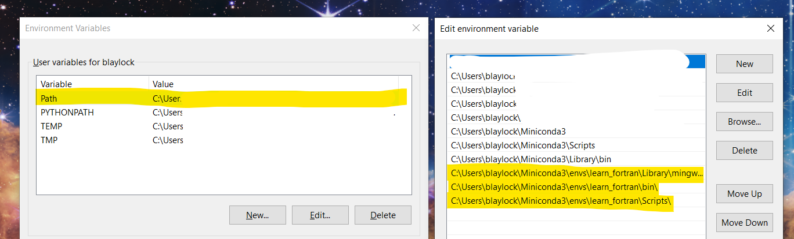

<div align=center>


# Learn Fortran

</div>

This is Brian's sandbox for learning Fortran using **VS Code**. I intend to setup the development environment to work on both Linux and Windows.

## Set up

### 1. Clone this repository 
Now open the folder/workspace in VS Code.

### 2. Install recommended VS Code extensions

Install the following recommended VS Code extensions. 

- Modern Fortran 
- Code Runner

### 3. Create the Conda environment

Assuming you have Conda installed, the fastest way to install the provided Conda environment is to run the VS Code custom workspace task:

1. Open command pallet with `Ctrl+Shift+P`.
1. Run `Tasks: Run Task`
1. Select `🐍 Conda: Create environment learn_fortran`

> **Note**: When you want to update the environment, run the task `🥇 Conda: Update environment learn_fortran`

### 4. Include conda programs in your PATH

Add `gfortran`, `fortls`, and `fprettify` to your environment PATH.

#### Windows

You can find the path for these programs with these commands in the Windows command prompt:

```batch
where gfortran
where fortls
where fprettify
```

Hit the `Windows Key` and search for and open `Edit environment variables for your account`. Click the `Path` line and `Edit`. Then click `New` and type the path for `gfortran`, `fortls`, `findent` and `fprettify`. You should have something like these three lines:

```
C:\Users\blaylock\Miniconda3\envs\learn_fortran\Library\mingw-w64\bin
C:\Users\blaylock\Miniconda3\envs\learn_fortran\Scripts
C:\Users\blaylock\Miniconda3\envs\learn_fortran\bin
```


#### Linux

```bash
which gfortran
which fortls
which fprettify
```

Your `.bashrc` file might have this line to append the PATH:

```bash
export PATH="$PATH:/Users/blaylock/anaconda3/envs/learn_fortran/bin"
```

## Quick Compile

I'm using the **Code Runner** extension to do a quick compile and run of a Fortran program. When you have a source code file in focus (i.e., `src/hello_world/hello_world.f90`), use the shortcut `Ctrl+Alt+N` to compile and run the Fortran program. The output will show below in the terminal window.

## Learning Resources

### Fortran Language

- https://fortran-lang.org/
- https://fortranwiki.org/fortran/show/HomePage

### Fortran in VS Code

- https://github.com/JHenneberg/Guide_VSCode-fortran
- https://marketplace.visualstudio.com/items?itemName=fortran-lang.linter-gfortran
